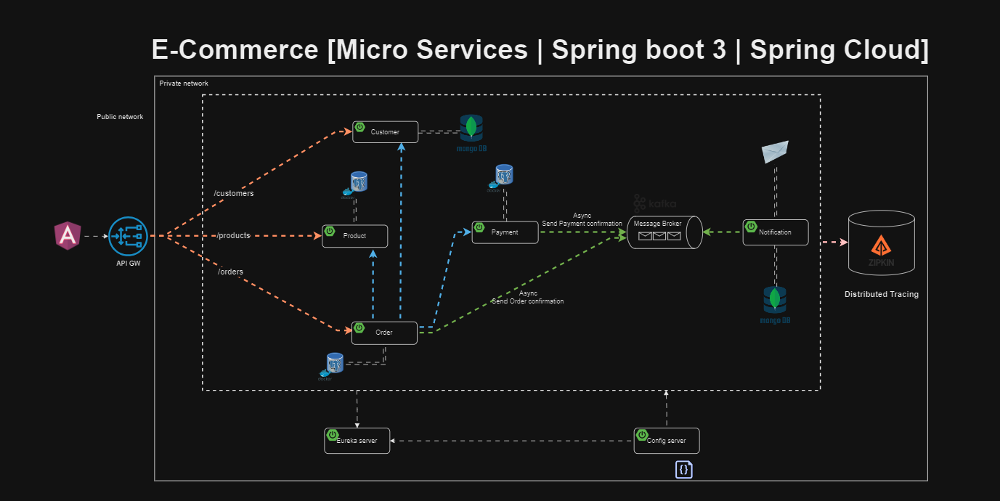

# E-commerce Project with Spring Boot Microservices

# About the project

### This project is based Spring Boot Microservices

8 services whose name are shown below have been devised within the scope of this project.

- Config Server
- Discovery Server
- Gateway
- Customer Service
- Order Service
- Product Service
- Payment Service
- Notification Service

### Used Dependencies

* Core
    * Spring
        * Spring Boot
        * Spring Web
            * FeignClient
        * Spring Data
            * Spring Data JPA
            * PostgreSQL
        * Spring Cloud
            * Spring Cloud Config Server
            * Spring Cloud Config Client
    * Netflix
        * Eureka Server
        * Eureka Client
* Database
    * PostgreSQL
    * MongoDB
* Kafka
* Keycloak
* Zipkin
* Docker
* Validation
* Lombok

### 🔨 Run the App

<b>Local</b>

<b>1 )</b> Clone project `git clone https://github.com/Gorgona9/e-commerce-with-microservices.git`

<b>2 )</b> Go to the project's home directory :  `cd e-commerce-with-microservices`

<b>3 )</b> Run docker compose <b>`docker compose up`</b></b>

<b>4 )</b> Run <b>Config Server</b>

<b>5 )</b> Run <b>Discovery</b>

<b>6 )</b> Run other services
